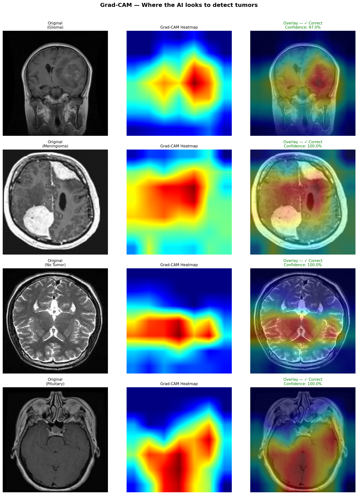

# 🧠 Brain Tumor Detection & Classification using Deep Learning


> An end-to-end deep learning project that classifies brain tumors from MRI scans into 4 categories with **89.31% test accuracy** and **96.25% validation accuracy**, featuring Grad-CAM explainability and a live Streamlit web application.

---

## 📋 Table of Contents

- [Problem Statement](#-problem-statement)
- [Demo](#-demo)
- [Dataset](#-dataset)
- [Project Structure](#-project-structure)
- [Approach](#-approach)
- [Models](#-models)
- [Results](#-results)
- [Grad-CAM Explainability](#-grad-cam-explainability)
- [Web Application](#-web-application)
- [Installation](#-installation)
- [Usage](#-usage)
- [Tech Stack](#-tech-stack)
- [Author](#-author)

---

## 🎯 Problem Statement

Brain tumors are among the most dangerous and life-threatening medical conditions. Early and accurate detection is critical for patient survival. Manual analysis of MRI scans by radiologists is time-consuming and subject to human error.

This project builds an AI-powered system that:
- Automatically classifies brain MRI scans into 4 categories
- Highlights the exact region of the brain the AI focuses on (Grad-CAM)
- Provides confidence scores for each prediction
- Delivers results through a user-friendly web interface

---

## 🌐 Demo

**Live App:** [Coming Soon — Streamlit Cloud]



---

## 📂 Dataset

**Source:** [Brain Tumor MRI Dataset — Kaggle](https://www.kaggle.com/datasets/masoudnickparvar/brain-tumor-mri-dataset)

| Split      | Images | Classes |
|------------|--------|---------|
| Training   | 4,480  | 4       |
| Validation | 1,120  | 4       |
| Testing    | 1,600  | 4       |
| **Total**  | **7,200** | **4** |

**Classes:**
| Class | Description |
|-------|-------------|
| 🔴 Glioma | Tumor in glial cells — most aggressive |
| 🟠 Meningioma | Tumor in brain membranes — usually benign |
| 🟢 No Tumor | Healthy brain scan |
| 🟣 Pituitary | Tumor in pituitary gland — often treatable |

---

## 📁 Project Structure

```
brain_tumor_project/
│
├── dataset/
│   ├── Training/
│   │   ├── glioma/
│   │   ├── meningioma/
│   │   ├── notumor/
│   │   └── pituitary/
│   └── Testing/
│       ├── glioma/
│       ├── meningioma/
│       ├── notumor/
│       └── pituitary/
│
├── models/
│   ├── cnn_model.h5           ← Basic CNN (84.75%)
│   └── best_model.keras       ← MobileNetV2 (89.31%)
│
├── app/
│   └── app.py                 ← Streamlit web application
│
├── gradcam_outputs/
│   └── gradcam_all_classes.png
│
├── 1_preprocess.py            ← Data loading & augmentation
├── 2_train_cnn.py             ← Basic CNN training
├── 3_train_transfer.py        ← MobileNetV2 transfer learning
├── 4_evaluate.py              ← Model evaluation & comparison
├── 5_gradcam.py               ← Grad-CAM heatmap generation
├── 6_predict.py               ← Standalone prediction function
├── requirements.txt
└── README.md
```

---

## 🔬 Approach

### Step 1 — Data Preprocessing
- Resized all images to **224×224** pixels
- Normalized pixel values to **[0, 1]** range
- Applied data augmentation:
  - Random rotation (±15°)
  - Horizontal flip
  - Width/height shift (10%)
  - Zoom (10%)
- Split training data: **80% train / 20% validation**

### Step 2 — Basic CNN (Baseline)
Built a custom CNN from scratch with:
- 3 convolutional blocks (32 → 64 → 128 filters)
- Batch normalization after each block
- Dropout for regularization (0.25 per block, 0.5 classifier)
- Dense classifier head with 256 units

### Step 3 — Transfer Learning (MobileNetV2)
Used MobileNetV2 pretrained on ImageNet:
- Froze all 154 base layers
- Added custom classifier head (512 → 256 → 4 units)
- Trained for 25 epochs with early stopping
- Used Adam optimizer with learning rate scheduling

### Step 4 — Evaluation
- Compared both models on test set
- Generated confusion matrices
- Computed per-class precision, recall, F1-score

### Step 5 — Grad-CAM Explainability
- Extracted gradients from last conv layer (`Conv_1`)
- Generated class activation heatmaps
- Overlaid heatmaps on original MRI scans

### Step 6 — Web Application
- Built with Streamlit
- MRI validity check before prediction
- Real-time Grad-CAM generation
- Confidence bar chart for all classes

---

## 🤖 Models

### Model 1 — Basic CNN
```
Architecture : 3× [Conv2D → BatchNorm → MaxPool → Dropout]
               → Flatten → Dense(256) → Dense(4)
Parameters   : ~2.1M
Optimizer    : Adam (lr=0.001)
Epochs       : 15 (early stopping at 14)
Test Accuracy: 84.75%
```

### Model 2 — MobileNetV2 Transfer Learning ⭐ (Best)
```
Base Model   : MobileNetV2 (ImageNet pretrained)
Frozen Layers: 154 (all base layers)
Head         : GlobalAvgPool → BN → Dense(512) → Dense(256) → Dense(4)
Parameters   : 2.6M total / 363K trainable
Optimizer    : Adam (lr=0.001 → 0.0003 scheduled)
Epochs       : 20 (early stopping at epoch 14 best)
Test Accuracy: 89.31%
Val Accuracy : 96.25%
```

---

## 📊 Results

### Accuracy Comparison

| Model | Test Accuracy | Val Accuracy |
|-------|--------------|--------------|
| Basic CNN | 84.75% | 88.39% |
| MobileNetV2 ⭐ | **89.31%** | **96.25%** |

### Per-Class Performance (MobileNetV2)

| Class | Precision | Recall | F1-Score | Support |
|-------|-----------|--------|----------|---------|
| Glioma | 0.94 | 0.76 | 0.84 | 400 |
| Meningioma | 0.85 | 0.83 | 0.84 | 400 |
| No Tumor | 0.92 | 0.99 | 0.95 | 400 |
| Pituitary | 0.87 | 0.99 | 0.93 | 400 |
| **Overall** | **0.90** | **0.89** | **0.89** | **1600** |

### Prediction Confidence on Sample Images

| Class | Predicted | Confidence |
|-------|-----------|------------|
| Glioma | Glioma ✅ | 100.00% |
| Meningioma | Meningioma ✅ | 96.27% |
| No Tumor | No Tumor ✅ | 88.94% |
| Pituitary | Pituitary ✅ | 100.00% |

---

## 🔥 Grad-CAM Explainability

Grad-CAM (Gradient-weighted Class Activation Mapping) makes the AI **explainable** — it shows exactly which regions of the MRI scan the model focuses on to make its decision.

```
🔴 Red / Yellow areas  →  High importance (tumor region)
🔵 Blue areas          →  Low importance (background)
```

This is critical for medical AI because doctors need to **trust and verify** AI decisions. The heatmap overlays allow radiologists to confirm the AI is focusing on the correct anatomical region.

**Grad-CAM Results:**
- Glioma     → 97.0% confidence, correct focus region ✓
- Meningioma → 100.0% confidence, correct focus region ✓
- No Tumor   → 100.0% confidence, correct focus region ✓
- Pituitary  → 100.0% confidence, correct focus region ✓

---

## 🌐 Web Application

The Streamlit app provides:

- **MRI Upload** — JPG/PNG support with validity check
- **Instant Prediction** — class + confidence in real time
- **Grad-CAM Overlay** — heatmap showing AI focus area
- **Confidence Chart** — bar chart for all 4 classes
- **Class Information** — medical description of detected condition

**Run locally:**
```bash
streamlit run app/app.py
```

---

## ⚙️ Installation

**1. Clone the repository:**
```bash
git clone https://github.com/YOUR_USERNAME/brain-tumor-detector.git
cd brain-tumor-detector
```

**2. Create virtual environment:**
```bash
python -m venv .venv
source .venv/bin/activate       # Linux/Mac
.venv\Scripts\activate          # Windows
```

**3. Install dependencies:**
```bash
pip install -r requirements.txt
```

**4. Download dataset:**

Download from [Kaggle](https://www.kaggle.com/datasets/masoudnickparvar/brain-tumor-mri-dataset) and place in `dataset/` folder.

**5. Train models (optional — pretrained models included):**
```bash
python 2_train_cnn.py           # Basic CNN
python 3_train_transfer.py      # MobileNetV2
```

**6. Run the app:**
```bash
streamlit run app/app.py
```

---

## 🔧 Usage

**Predict a single image:**
```python
from 6_predict import predict

result = predict('path/to/mri_scan.jpg')
print(result['class'])       # e.g. 'Glioma'
print(result['confidence'])  # e.g. 97.5
print(result['all_scores'])  # scores for all 4 classes
```

**Generate Grad-CAM:**
```bash
python 5_gradcam.py
```

**Evaluate both models:**
```bash
python 4_evaluate.py
```

---

## 🛠️ Tech Stack

| Category | Technology |
|----------|-----------|
| Language | Python 3.12 |
| Deep Learning | TensorFlow 2.21, Keras |
| Transfer Learning | MobileNetV2 (ImageNet) |
| Explainability | Grad-CAM |
| Computer Vision | OpenCV, Pillow |
| Data Processing | NumPy, scikit-learn |
| Visualization | Matplotlib, Seaborn |
| Web App | Streamlit |
| GPU | NVIDIA RTX 3050 6GB (CUDA 12.5) |
| IDE | PyCharm |

---

## 🔮 Future Work

- [ ] Deploy on Streamlit Cloud (public link)
- [ ] Support DICOM format (real hospital MRI format)
- [ ] Generate downloadable PDF report per scan
- [ ] Add patient history tracking
- [ ] Improve Meningioma recall (currently 83%)
- [ ] Try EfficientNetB4 for higher accuracy
- [ ] Add multi-language support

---

## ⚠️ Disclaimer

This project is for **educational and research purposes only**. It is not intended for clinical use or medical diagnosis. Always consult a qualified medical professional for any health concerns.

---

## 👨‍💻 Author

**Dipendra**

---

## 📜 License

This project is licensed under the MIT License — see the [LICENSE](LICENSE) file for details.

---

<div align="center">
  <strong>⭐ If this project helped you, please give it a star on GitHub! ⭐</strong>
</div>
